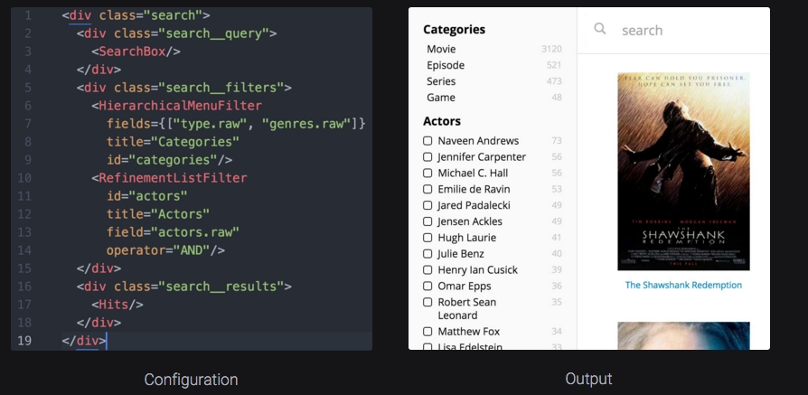

# What is Searchkit?

```jsx
const searchkit = new SearchkitManager("http://demo.searchkit.co/api/movies/")

const App = ()=> (
  <SearchkitProvider searchkit={searchkit}>
    <Layout>
      <TopBar>
        <SearchBox
          autofocus={true}
          searchOnChange={true}
          prefixQueryFields={["actors^1","type^2","languages","title^10"]}/>
      </TopBar>
      <LayoutBody>
        <SideBar>
          <HierarchicalMenuFilter
            fields={["type.raw", "genres.raw"]}
            title="Categories"
            id="categories"/>
          <RefinementListFilter
            id="actors"
            title="Actors"
            field="actors.raw"
            operator="AND"
            size={10}/>
        </SideBar>
        <LayoutResults>
          <ActionBar>

            <ActionBarRow>
              <HitsStats/>
            </ActionBarRow>

            <ActionBarRow>
              <SelectedFilters/>
              <ResetFilters/>
            </ActionBarRow>

          </ActionBar>
          <Hits mod="sk-hits-grid" hitsPerPage={10} itemComponent={MovieHitsGridItem}
            sourceFilter={["title", "poster", "imdbId"]}/>
          <NoHits/>
        </LayoutResults>
      </LayoutBody>
    </Layout>
  </SearchkitProvider>
)

ReactDOM.render(<App/>, document.getElementById('root'))

```
Searchkit is a suite of UI components built in react. The aim is rapidly create beautiful search applications using declarative components, and without being an ElasticSearch expert.



See [Getting Started](/setup/README.md)
[Live demo](http://demo.searchkit.co)
